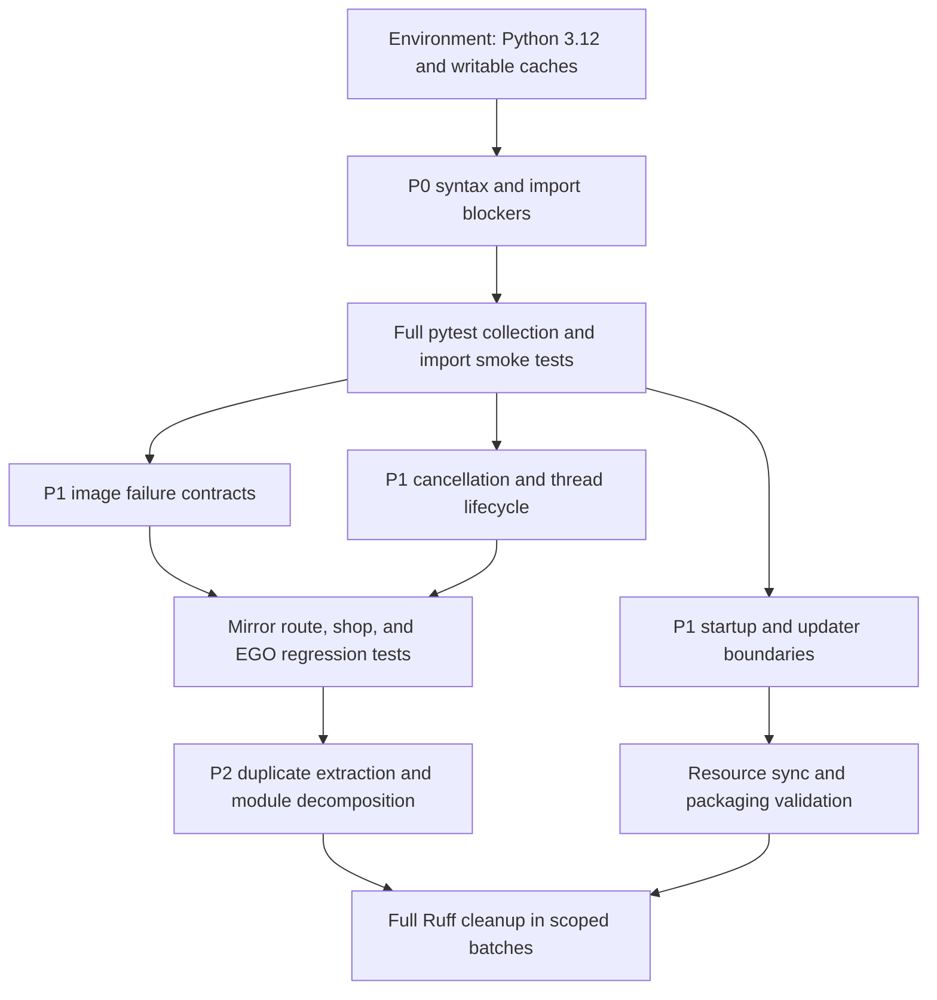

# Code Health Audit

## 1. Audit Metadata

- Audit date: 2026-08-16
- Audited revision: `37440bf` (`dev-jules`)
- Scope: tracked Python source, tests, maintenance scripts, entry points, packaging and version configuration, CI/release workflows, Git history, and the newest available log
- Change policy for this phase: documentation only; no source, test, configuration, asset, or packaging changes
- Decision policy: preserve observable behavior until regression tests establish the intended contract

This document is a triage baseline, not proof that every listed hypothesis is a defect. Items marked **Confirmed** have current static, test-collection, or direct code evidence. Items marked **Historical evidence** require reproduction against the repaired current tree. Items marked **Review candidate** require focused analysis before any refactor.

## 2. Repository and Tooling Baseline

### 2.1 Worktree state

- Git reports the branch as `dev-jules...origin/dev-jules`.
- `.Jules/palette.md` contains 23 existing added lines. This is user work and must not be overwritten, reverted, reformatted, or included in code-health cleanup commits.
- Git initially rejected repository access because the directory owner SID differs from the current user SID. Audit commands used the command-local option `-c safe.directory=E:/PUBLIC/Project/AALC/AhabAssistantLimbusCompany`; no global Git setting was changed.
- Git cannot read `.pytest_cache/` because of an access-denied error. Treat the cache as an environment issue, not as source to repair.
- The tracked root files `commit_it.py`, `fix_find_element_screenshot.py`, `fix_image_utils_load_method.py`, `fix_image_utils_target.py`, and `fix_simulator.py` are one-off mutation scripts and cleanup candidates.

### 2.2 Python and dependency environment

- `pyproject.toml` requires Python 3.12 or newer, while the existing `.venv` reports Python 3.13.6. Python 3.13 may expose compatibility differences not present in the intended Python 3.12 development and packaging environment.
- `uv run` cannot initialize its default cache at `C:\Users\AscAed\AppData\Local\uv\cache` because access is denied. The audit therefore used executables from `.venv` where possible.
- Before repair validation, create or select a Python 3.12 environment and use a writable `UV_CACHE_DIR` outside the tracked source tree.

### 2.3 Static and test baseline

- The repository has 131 tracked Python files: 26 under `app/`, 46 under `module/`, 27 under `tasks/`, 8 under `utils/`, 9 under `scripts/`, and 7 under `tests/` (123 directory files), plus 8 root files: `main.py`, `main_dev.py`, `updater.py`, and five one-off repair scripts. The earlier runtime-only count of 119 means 116 package files plus the 3 root entry files; it must not be presented as the full-repository Python count.
- AST parsing currently fails for three files: `module/automation/automation.py`, `module/automation/input_handlers/simulator/__init__.py`, and `tasks/mirror/search_road.py`.
- `ruff check . --statistics` reports 567 findings: 395 `F405`, 64 `T201`, 30 `F401`, 20 `E402`, 13 syntax findings, 11 `E722`, 10 `F841`, 9 `I001`, 6 `F403`, 4 `F821`, 2 `E712`, 2 `F811`, and 1 `E741`.
- `pytest --collect-only -q` collects 8 tests and fails while importing 4 automation test modules because `module/automation/automation.py:716` raises `IndentationError`.
- The repository currently contains only 7 test files. Coverage is especially thin relative to the size of Mirror, UI, updater, resource synchronization, CI/release, and task lifecycle modules.
- The newest available `logs/debugLog.log` line is timestamped `2026-07-19 11:46:27`, while this audit is dated `2026-08-16`; the log is historical and 28 days stale at audit time. It contains 30,634 lines, 354 `Traceback` markers, 1,344 error records, 398 OpenCV records, 37 forced-stop records, and 325 `DEFAULT VERSION` records.
- `PROJECT.md` marks an “E2E Testing Suite” milestone as `DONE`, but the current tree contains no separately named E2E suite and only the 7 unit-oriented test files listed above. Because collection is currently blocked, that milestone is **unverified and contradicted by the current test evidence** until the suite, fixtures, and execution report are located or the project document is corrected.

## 3. Duplicate Classification Rules

Repeated text must be classified before editing:

1. **Conflict splice**: incompatible old and new implementations are interleaved or concatenated. Remove only after reconstructing the intended control flow from tests and Git history.
2. **Same-scope override**: a later definition silently replaces an earlier definition. Confirm decorators and overloads before treating this as a defect.
3. **Extractable duplication**: behavior is repeated and should share a helper, constant, or data model once tests protect its callers.
4. **Interface parity**: multiple backends intentionally implement the same public operations. Preserve the separate implementations unless a shared base helper reduces real risk.
5. **False positive**: property getter/setter pairs, `typing.overload` declarations, short framework setup, and similar patterns that should remain.

Confirmed false positives from the AST name scan include:

- `SinnerSelect.end_geom` in `app/base_combination.py`: property getter and setter.
- `Handle.client_to_window` in `module/game_and_screen/screen.py`: two overload declarations and one implementation.
- `Input.pos_offset` and `WindowMoveInput._set_window_pos` in `module/automation/input_handlers/input.py`: overload declarations and implementations.

## 4. P0 - Current Parse and Import Blockers

### P0-01: Broken fast-path splice in vision matching

- Status: **Confirmed**
- Module: `module/automation/automation.py`
- Location: lines 683-720, with the syntax failure at line 716
- Classification: conflict splice
- Evidence: the scale loop already computes `best_match_val` and sets `matched` after the loop. Lines 715-718 then add an over-indented early-exit block outside its valid loop scope, including a `break` that cannot belong there.
- Git evidence: the surrounding multi-scale implementation originates mainly from `e901940`; the invalid fast-path lines were introduced by `4d9b4ee` and later merged into the current branch.
- Impact: importing `module.automation` fails, blocking application startup paths and four automation test modules.
- Dependency: repair this before meaningful test collection, vision regression work, or Mirror analysis.
- Required tests: parse/import smoke test; multi-scale template match with first-scale success, later-scale success, no match, oversized template, crop offset, and edge fallback.
- Unverified assumption: the intended optimization may belong inside the scale loop, but its acceptable early-exit threshold must be confirmed from the introducing commit and tests rather than inferred from indentation alone.

### P0-02: Duplicated simulator point filtering with an empty branch

- Status: **Confirmed**
- Module: `module/automation/input_handlers/simulator/__init__.py`
- Location: lines 54-89, with the syntax failure beginning at line 67
- Classification: conflict splice and exact duplicate behavior
- Evidence: two equivalent squared-distance checks appear at lines 67 and 70; the first `if` has no body. Two consecutive post-processing loops also perform the same distance filtering using `filtered_points` and `new_points`.
- Git evidence: overlapping implementations came from commits including `dc43ea7`, `12997a6`, `2f524f5`, `8eff896`, and the root repair-script commit `6054782`.
- Impact: direct import of the simulator helper fails; simulator input paths cannot be considered runnable.
- Dependency: repair before simulator tests or any consolidation of input backends.
- Required tests: zero-length path, short path, normal path, endpoint preservation, minimum-distance invariant, deterministic testing through patched randomness, and absence of one-point output.
- Security constraint: do not preserve or add randomness for the purpose of evading game security auditing. Any retained variation must have a documented stability or input-driver requirement and deterministic tests.

### P0-03: Interleaved normal and hard Mirror route flow

- Status: **Confirmed**
- Module: `tasks/mirror/search_road.py`
- Location: lines 248-320, with the syntax failure around line 291
- Classification: conflict splice and repeated state handling
- Evidence: bus-position retry logic is partly nested under `hard_mode`, followed by a duplicated fallback containing an orphaned `break`; the hard-mode branch then repeats the missing-position return with invalid indentation.
- Git evidence: the original branching is primarily associated with `e62043b`, while overlapping changes around the current damaged region include `fc0257b` and `756d504`.
- Impact: the module cannot parse, so Mirror route selection is unavailable even after the automation import blocker is repaired.
- Dependency: repair after the automation import path, before route optimization or algorithm changes.
- Required tests: normal-mode setup, hard-mode three-attempt lookup, default/max-distance fallback, missing bus, no next node, direction selection, bounded scrolling, and user cancellation.
- Unverified assumption: the normal and hard modes likely require separate location flows; reconstruct the exact intended ordering from history and existing call sites.

### P0-04: Duplicate empty state-detection branches in the same automation module

- Status: **Confirmed**, independently of the earlier parser cascade
- Module: `module/automation/automation.py`
- Location: `detect_state()` around lines 1079-1117
- Classification: conflict splice and duplicate state machine branch
- Evidence: a complete `MIRROR_ENTRANCE` check at lines 1079-1083 is followed by an empty duplicate predicate at lines 1084-1086 and another duplicate predicate with a return at lines 1114-1117. The theme-pack predicate at lines 1088-1090 is also empty, while the same state is checked earlier at lines 1058-1059 and later returned at 1091. These empty branches produce additional Ruff syntax findings (`1084` and `1088`) after the line-716 parser error is considered.
- Impact: even after repairing `find_feature_element`, the state dispatcher remains syntactically invalid or may check the same state multiple times with inconsistent screenshot-cache options.
- Git evidence: the cached-frame priority implementation is associated with `99a9f68`; later duplicate state-order blocks were merged through the performance branches touching `automation.py`.
- Required tests: one screenshot per detection pass, priority ordering for battle/team/shop/theme/EGO/claim/event/entrance/road/home states, and a no-match `UNKNOWN` result.
- Unverified assumption: only one of the three entrance checks should remain; the final ordering must be derived from the state enum and callers, not selected by line position.

## 5. P1 - Confirmed Runtime and Reliability Risks

### P1-01: Undefined `functools` and unsafe image failure contracts

- Status: **Confirmed** for the undefined name; **Historical evidence** for the full runtime failure chain
- Modules: `utils/image_utils.py`, `module/automation/automation.py`
- Locations: `utils/image_utils.py:116` and image matching/loading exception paths around lines 92, 145, and 317
- Classification: missing dependency plus inconsistent failure contracts
- Evidence: Ruff reports `F821 Undefined name functools` at the `@functools.lru_cache` decorator. The newest available log contains OpenCV template-size assertion failures followed by `cannot unpack non-iterable NoneType object` in automation lookup code.
- Historical log evidence: `logs/debugLog.log` records 398 OpenCV error occurrences and repeated failures around `utils/image_utils.py:253` and `module/automation/automation.py:879`. These line numbers refer to the logged revision and must not be assumed to match current source.
- Impact: import or decorated method definition may fail after P0 repair; invalid image dimensions can cascade into misleading secondary exceptions.
- Required tests: missing template, unreadable image, empty screenshot, template larger than screenshot, grayscale/RGB combinations, cache hit/miss, and stable typed failure results.

### P1-02: Theme-pack reset references an undefined configuration object

- Status: **Confirmed**
- Module: `app/theme_pack_setting_interface.py`
- Location: `reset_to_default()` at lines 1067-1087
- Classification: undefined name and incomplete reset branch
- Evidence: Ruff reports three `F821` findings because `example_config` is referenced at lines 1074, 1075, and 1077 but is never defined in the module or method. The global branch loads `default_cfg`, while the floor-specific branch reads the undefined object; the preferred-threshold update also references it unconditionally.
- Impact: invoking the theme-pack reset action can raise `NameError` and leave the UI/configuration partially reset.
- Required tests: reset global config, reset floor-specific overrides, preferred-threshold reset, unsaved-state tracking, and save/reload round trip.
- Unverified assumption: the intended source may be `theme_list.load_config(...)` or the example YAML; confirm the config ownership in `module/config/config.py` before replacing the name.

### P1-03: Input backend duplication and security-boundary review

- Status: **Review candidate** with confirmed duplicated blocks
- Modules and locations: `module/automation/input_handlers/input.py` (`Input` lines 161-364, `BackgroundInput` lines 365-882, `WindowMoveInput` lines 883-1150), `module/automation/input_handlers/__init__.py` (`AbstractInput`), `module/automation/input_handlers/simulator/simulator_control.py` (`SimulatorControl`), and `module/automation/input_handlers/simulator/mumu_control.py` (`MumuControl`)
- Classification: mixture of interface parity and extractable duplication
- Evidence: repeated click, drag, pause, cursor-path, driver dispatch, and mouse button blocks occur within `input.py` and across the abstract, simulator, and MuMu implementations. Some repetition is required by backend-specific protocols.
- Security evidence: comments and helpers explicitly describe randomized coordinates and delays as avoiding fixed or pixel-perfect patterns. That purpose conflicts with the repository rule prohibiting randomized input intended to defeat security auditing.
- Impact: backend behavior can drift; fixes may land in only one copy; unsupported randomness makes timing tests non-reproducible and crosses the stated maintenance boundary.
- Required tests: shared input contract tests for foreground, background, window-move, simulator, and MuMu backends using fakes; timeouts and cancellation; coordinate transforms; driver/no-driver behavior; deterministic timing policy.
- Refactor guardrail: do not merge backend implementations merely because their docstrings or method names match.

### P1-04: Startup and updater exception/loop boundaries

- Status: **Confirmed code risk** and **Historical evidence** for version failures
- Modules and locations: `main.py` (`while True` line 73 and broad handlers around lines 32-99), `updater.py` (`while True` lines 75, 108, and 212), and `module/update/check_update.py` (`UpdateThread` line 39 and update handlers around lines 156-180, 294-308, 445, and 505)
- Classification: broad exception handling, unbounded-loop review, and invalid version contract
- Evidence: `main.py` contains `while True` and broad exception handlers; `updater.py` contains three `while True` loops and multiple broad handlers; `check_update.py` also catches broad exceptions at several network and update boundaries.
- Historical log evidence: `DEFAULT VERSION` repeatedly causes `packaging.version.InvalidVersion`, makes both update sources fail, and causes resource synchronization to be skipped.
- Impact: startup and update failures can be hidden, retried without a clear terminal state, or reported as unrelated network failures.
- Required tests: invalid local version, unavailable update sources, partial download, timeout, child-process shutdown, IPC disconnect, bounded retries, and user-visible terminal error state.

### P1-05: Task stop lifecycle and forced thread termination

- Status: **Confirmed code risk** and **Historical evidence**
- Modules: `app/farming_interface.py`, `tasks/base/`, `tasks/mirror/mirror.py`
- Locations: `app/farming_interface.py:740-753` and task cancellation/error paths
- Classification: lifecycle contract duplication and unsafe recovery
- Evidence: after a bounded wait, `farming_interface.py` invokes `self.my_script.terminate()`. The log contains 37 occurrences of failure to stop within the allowed time followed by forced termination.
- Historical behavior: a user-requested stop is logged as a Mirror route error before the thread fails to stop cleanly.
- Impact: forced termination can leave input state, config writes, resources, or UI state inconsistent and produces misleading error reporting.
- Required tests: stop while idle, during recognition, during route planning, during retry sleep, and during external process interaction; idempotent repeated stop; user cancellation classified separately from failure.

### P1-06: Python version drift and CI validation gap

- Status: **Confirmed configuration risk**
- Files and locations: `.python-version:1`, `pyproject.toml:8`, `assets/config/version.txt:1`, `.github/workflows/ci.yaml:35,63-66`, and `.github/workflows/reusable-build.yml:29`
- Classification: environment contract drift and incomplete quality gate
- Evidence: `.python-version` pins `3.13.6`, while the development and build guides require Python 3.12. The CI test job runs `uv sync --frozen` without explicitly selecting Python 3.12, so it follows the repository pin. CI runs `pytest -ra` but does not run Ruff, AST/compile checks, or focused resource/config validation. `assets/config/version.txt` contains the sentinel `DEFAULT VERSION`, which the log proves is rejected by `packaging.version` during update checks.
- Impact: CI can validate only one Python version and currently does not gate known lint/import defects; local and packaged version behavior diverge.
- Required tests: explicit Python 3.12 CI job, syntax/import smoke check before pytest, Ruff (or a scoped baseline gate), version sentinel handling, and release-build version injection verification.
- Unverified assumption: Python 3.13 may be intentionally supported despite the 3.12 documentation; resolve this as a project contract before changing the pin or workflow.

## 6. P2 - Structural Duplication and Maintainability Risks

### P2-01: UI base module implicit namespace and duplicate imports

- Status: **Confirmed**
- Module and locations: `app/base_combination.py:1-60`, including duplicate `TransparentToolButton`/`FIF` imports and `from app.base_tools import *`
- Classification: same-scope import override and implicit dependency surface
- Evidence: Ruff reports 177 findings in this file. `TransparentToolButton` and `FIF` are imported twice, while `from app.base_tools import *` causes most `F405` reports and obscures the actual dependency list.
- Impact: merge conflicts are harder to resolve, undefined names may be hidden by star imports, and import cleanup cannot be safely automated.
- Required tests: import smoke test plus focused widget construction tests before replacing star imports.

### P2-02: Large UI classes and repeated initialization patterns

- Status: **Review candidate**
- Modules and locations: `app/page_card.py` (`PageMirror` line 408), `app/team_setting_card.py` (`TeamSettingCard` line 67, `CustomizeSettingsModule` line 629, `ObserveEgoGiftModule` line 1197), `app/farming_interface.py` (`FarmingInterfaceLeft` line 418), and `app/theme_pack_setting_interface.py` (`ThemePackSettingDialog` line 553)
- Classification: extractable duplication mixed with legitimate widget composition
- Evidence: Ruff reports 78 findings in `page_card.py`, 72 in `team_setting_card.py`, and 63 in `farming_interface.py`. `TeamSettingCard`, `CustomizeSettingsModule`, and `ObserveEgoGiftModule` are each hundreds of lines; repeated widget initialization and system-list definitions appear in the scan.
- Impact: UI state, translations, signals, and config bindings can diverge across copied sections.
- Required tests: widget construction, signal connection count, translation refresh, config round-trip, disposal, and repeated page creation.

### P2-03: Mirror monoliths and repeated recognition/action sequences

- Status: **Review candidate**
- Modules and locations: `tasks/mirror/mirror.py` (`Mirror` line 51, `run` line 230, `select_observe_ego_gift` line 1038, `acquire_ego_gift` line 1518) and `tasks/mirror/in_shop.py` (`Shop` line 16, `buy_gifts` line 117, `fuse_useless_gifts_aggressive` line 404, `fuse_useless_gifts` line 605, `enhance_gifts` line 1158)
- Classification: extractable duplication and oversized stateful classes
- Evidence: `Mirror` spans roughly 1,772 lines and its `run` method roughly 595 lines; `Shop` spans roughly 1,698 lines. Repeated acquire-card bounding boxes, gift selection/confirmation sequences, retry loops, and fixed sleeps appear within these modules.
- Impact: state resets, cancellation, retry bounds, and failure recovery are difficult to reason about and easy to duplicate inconsistently.
- Required tests: state transitions, failed recognition, bounded retries, shop fusion, EGO selection, route decisions, cancellation, and safe-stop behavior using offline fixtures.

### P2-04: Duplicated shared domain constants

- Status: **Confirmed duplication; design decision pending**
- Modules and locations: `app/__init__.py:134-160` and `tasks/__init__.py:14-79`
- Classification: extractable duplication
- Evidence: both modules define matching sinner-name sequences and status-system mappings.
- Impact: UI and task code can disagree when content is updated in only one location.
- Required tests: shared constant integrity and existing serialization/config compatibility.

### P2-05: One-off repair scripts committed at repository root

- Status: **Confirmed maintenance residue**
- Files and locations: `commit_it.py:1-2`, `fix_find_element_screenshot.py:1-25`, `fix_image_utils_load_method.py:1-90`, `fix_image_utils_target.py:1-85`, and `fix_simulator.py:1-100`
- Classification: conflict-resolution tooling residue
- Evidence: the scripts rewrite source through ad hoc text replacement, remove methods by ordinal occurrence, or append replacement implementations. They are tracked, have no tests, and several were introduced together in commit `6054782`.
- Impact: accidental execution can overwrite valid code; the scripts encode assumptions that are no longer trustworthy and provide evidence of prior concatenation-based repairs.
- Required action before deletion: confirm they are not referenced by CI, packaging, documentation, or release procedures; preserve relevant intent in Git history or the audit issue that replaces them.

## 7. Additional Review Queues

These modules are not yet classified as defects but should be examined after P0 and P1 stabilization:

- `updater.py`: 33 non-`F405` Ruff findings and a 256-line updater class.
- `scripts/match_steam_image.py`: 24 findings, nested import fallbacks, and broad exception suppression.
- `module/config/config.py`: large configuration loader and migration logic with limited schema tests.
- `module/resource_sync/service.py` and `app/resource_sync_coordinator.py`: large stateful services whose update behavior depends on the version-check path.
- `tasks/battle/battle.py`: unbounded-loop candidates and a roughly 388-line fight method.
- `tasks/base/make_enkephalin_module.py`: repeated timing loops detected by the exact-block scan.
- `app/windows_toast.py`: repeated conditional import blocks and unused optional imports; determine whether this is intentional compatibility handling.
- `main.py` and `main_dev.py`: duplicated DPI setup is likely legitimate entry-point parity, but a shared side-effect-free helper may reduce drift after startup behavior is covered.
- `module/automation/input_handlers/simulator/pyminitouch/actions.py`: bare exception and unused coordinate variables require backend-specific review.
- `tasks/base/make_enkephalin_module.py` and `tasks/teams/team_formation.py`: bare exceptions, ambiguous variables, and repeated timing loops need bounded-failure tests.
- `scripts/build_image_resource_manifest.py`: unused manifest assignment and resource-output failure paths need packaging tests.
- `app/setting_interface.py`: unused progress-bar local indicates a potentially incomplete UI update path.
- `tests/unit/module/automation/test_input.py`, `test_state_flow.py`, and `test_vision.py`: unused fixtures suggest tests may not exercise the mocked dependencies they declare.

### 7.1 CI and release workflow review queue

The seven workflow files under `.github/workflows/` are part of the repository's executable maintenance surface and were not included in the original module list. Review them after P0 restoration:

- `ci.yaml`: tests only; no Ruff or syntax gate; triggers only `main` pushes and pull requests.
- `reusable-build.yml` and `release.yaml`: packaging and release version propagation must be tested after the version sentinel issue is clarified.
- `depends_export.yaml`: generated `requirements.txt` pull-request automation needs a clean working-tree and dependency reproducibility check.
- `image_resource_publish.yaml`: external repository pushes and artifact creation require secret-missing, partial-build, and cleanup tests.
- `mirrorchyan_release.yml` and `mirrorchyan_release_note.yml`: release-note and external publish failures need explicit terminal status and retry boundaries.

## 8. Repair Dependency Order



Recommended repair batches:

1. Environment normalization and the three P0 syntax repairs, with no behavioral optimization.
2. Import/test baseline restoration, including `functools` and focused vision contracts.
3. Cancellation, retry, timeout, and error-classification fixes.
4. Mirror state-flow regression coverage before deduplicating Mirror code.
5. Input backend contract tests and security-boundary cleanup.
6. UI star-import removal and repeated initialization cleanup.
7. Root repair-script retirement, updater/resource-sync hardening, then remaining Ruff work.

Each batch should be independently reviewable and should not include unrelated formatting.

## 9. Validation Commands

Run from a Python 3.12 environment with a writable cache:

```powershell
$env:UV_CACHE_DIR = Join-Path $env:TEMP "aalc-uv-cache"
uv sync
uv run python -m compileall -q app module tasks utils scripts main.py main_dev.py updater.py
uv run pytest --collect-only -q
uv run pytest -ra
uv run ruff check .
git -c safe.directory=E:/PUBLIC/Project/AALC/AhabAssistantLimbusCompany diff --check
git -c safe.directory=E:/PUBLIC/Project/AALC/AhabAssistantLimbusCompany status --short
```

For every repair batch, also run focused tests for the touched module before the complete suite. If Python 3.12 cannot be provisioned, report validation as incomplete rather than treating Python 3.13 results as the release baseline.

## 10. Acceptance Criteria for the Audit Phase

- Every P0 and P1 item has a current code location, evidence type, impact, dependency, and required regression coverage.
- Historical log evidence is not presented as proof of the current root cause.
- Property setters, overload declarations, and backend interface parity are not listed as code to delete.
- Generated files, caches, logs, and local configuration are documented only as environment risks.
- `.Jules/palette.md` remains unchanged by this audit.
- No business implementation, test, configuration, asset, translation, or packaging file is modified in this phase.

## 11. Second-pass Verification Record

This section records the verification performed after the first version of this audit document was written.

- Worktree check: `git status --short --branch` shows only the pre-existing `.Jules/palette.md` modification and this untracked audit document; `.pytest_cache/` remains inaccessible but no source file changed.
- File inventory: `git ls-files '*.py'` reports 131 files, split as documented in section 2.3.
- AST scan: all 131 tracked Python files were attempted; exactly three parse failures remain, and the four same-name groups are overload/property declarations rather than silent duplicate implementations.
- Ruff baseline: `.venv/Scripts/ruff.exe check . --statistics` reproduces 567 findings with the category counts in section 2.3. The focused hard-error scan confirms the three P0 files, `functools`, `example_config`, duplicate imports, bare exceptions, and unused locals listed in this document.
- Pytest collection: `.venv/Scripts/pytest.exe --collect-only -q` reproduces 8 collected tests and 4 collection errors at `module/automation/automation.py:716`, plus the expected `.pytest_cache` access warning.
- Log scan: `logs/debugLog.log` reproduces the timestamp range and record counts in section 2.3; no claim in this document treats the historical log as a current root-cause proof.
- CI/config scan: all seven `.github/workflows/` files, `.python-version`, `assets/config/version.txt`, `pyproject.toml`, and the build specs were inspected; the version drift, missing quality gates, and release/resource review queue are recorded above.
- Evidence integrity: every file path and Git short hash cited in the P0-P2 entries exists in the current worktree or object database; the audit document contains no trailing whitespace, and `git diff --check` reports no whitespace errors for tracked changes.

## 12. 解决方案登记（第一轮）

本节只登记解决思路与实施路径，不改变第 2 至 11 节的审计证据。后续修复按批次独立执行；每个条目中的“状态”均为登记时的计划状态。

### 12.0 决策记录

- Python 版本统一为 3.12：`.python-version`、CI 与打包流程均以 Python 3.12 为基线，3.13 只用于兼容性观察，不作为发布验证环境。
- 随机输入确定化：`input.py`、`bezier.py`、`delay.py`、`simulator_control.py` 中的随机坐标与随机延迟已移除，改为确定性输入；公开接口保持不变，测试覆盖确定性行为。
- `.Jules/palette.md` 保护：已有 23 行用户修改保持原样，不覆盖、不重排、不纳入清理提交。
- P0 不做优化：恢复语法与可运行行为，不引入新的匹配快速退出或行为变更。

### 12.1 P0-01：恢复视觉匹配的语法拼接

- 状态/批次：已完成，批次 1。
- 解决思路：`module/automation/automation.py:715-718` 是合并时拼入的越界快速退出块，不能简单按“较新实现”保留；先恢复原有循环后统一阈值判断，快速退出作为独立优化项另行评估。
- 解决方案：删除第 715 至 718 行中越界缩进的 `# Bolt: Fast-path early exit` 注释、`if best_match_val >= threshold`、`matched = True` 和 `break`；保留循环后的 `threshold = 0.70` 与 `matched = best_match_val >= threshold`。
- 行为/接口契约：`find_feature_element(target, pic_crop=None, min_matches=8, additional_stack=0)` 的签名和返回类型不变；返回全部尺度中的最佳中心点，无匹配时返回 `None`。
- 回归测试：模块导入冒烟；首尺度命中、后续尺度命中、全部未命中、模板大于截图、裁剪偏移、边缘匹配失败五类场景。
- 验收标准：`automation.py` 可解析，四个自动化测试模块可收集，相关视觉测试全部通过，且未引入新的快速退出行为。

### 12.2 P0-02：合并模拟器滑动点过滤

- 状态/批次：已完成，批次 1。
- 解决思路：`module/automation/input_handlers/simulator/__init__.py:54-89` 中两个平方距离判断和两段后处理循环表达相同意图，属于冲突拼接与同语义重复，不是不同协议。
- 解决方案：删除第 67 行无体的 `if`；保留第 70 行的平方距离检查；将 `filtered_points` 与 `new_points` 两段完全相同的单遍过滤合并为一段；保留 `len(points) <= 1` 时 `points = [p0.tolist(), p3.tolist()]` 的端点兜底。
- 行为/接口契约：`insert_swipe(p0, p3, speed=15, min_distance=10)` 签名不变，返回仍为 `list[list[int]]`；合并后的过滤对同一起点距离超过 `min_distance` 的点集是幂等的，不改变有效输出。
- 回归测试：零长度路径、短路径、普通路径、端点保留、最小距离不变式、对随机控制点打桩后的确定性结果、禁止单点输出。
- 验收标准：模块可导入；上述测试全部通过；无重复过滤循环残留。

### 12.3 P0-03：重排普通与困难镜牢寻路分支

- 状态/批次：已完成，批次 1 + 批次 4。
- 解决思路：`tasks/mirror/search_road.py:263-320` 把困难模式定位逻辑插入普通模式前段，导致普通模式在扫描前就进入早期巴士判断；应从历史提交和调用方恢复两条独立流程。
- 解决方案：困难模式内先执行最多 3 次有界巴士定位，失败立即 `return False, []`，随后进入单步节点决策并返回 `[direction], [best_class]`；普通模式完全跳过这段早期判断，继续原有缩小、扫描、全景缩放回退流程，复用第 397 至 437 行的巴士再定位；删除第 276 至 279 行的孤立 `break` 与重复等待、第 287 至 291 行的重复失败返回和缩进损坏段。
- 行为/接口契约：`search_road_from_road_map(hard_mode=False)` 的返回值结构不变；困难模式为单步结果，普通模式为全局路网规划结果。
- 回归测试：普通模式完整扫描、困难模式三连定位、定位失败、无前方节点、默认距离与最大距离兜底、方向选择、取消与有界滚动。
- 验收标准：文件可解析；普通与困难模式分别走各自分支；无孤立 `break`、重复失败返回或跨分支缩进。

### 12.4 P0-04：清理状态检测重复分支

- 状态/批次：已完成，批次 1。
- 解决思路：`detect_state()` 中已有的缓存帧优先级检查是完整实现，第 1084 至 1117 行是后来并入的重复空分支和陈旧状态块；保留唯一入口检查即可。
- 解决方案：为第 1079 至 1083 行的首个 `MIRROR_ENTRANCE` 检查补回 `return GameState.MIRROR_ENTRANCE`；删除第 1084 至 1117 行的重复 `MIRROR_ENTRANCE`、主题包、EGO、事件、路网、奖励检查块；保留第 1033 至 1077 行与第 1119 至 1124 行的缓存帧检查顺序。
- 行为/接口契约：`detect_state()` 返回 `GameState` 成员，一次检测只截取一张截图；状态优先级保持战斗、队伍选择、编队、商店、主题包、路网、EGO、奖励、事件、入口、主页、未知。
- 回归测试：每个状态通过伪造 `find_element` 返回值命中；重复元素同时出现时按优先级返回；无匹配返回 `GameState.UNKNOWN`；断言单次检测截图次数为一。
- 验收标准：`detect_state()` 无空分支、无重复状态检查，测试覆盖所有状态分支。

### 12.5 P1-01：修复图片工具未定义名称与失败契约

- 状态/批次：已完成，批次 2。
- 解决思路：`functools` 未导入是可确认的 `F821`；模板尺寸与 `None` 解包问题属于失败契约不一致，历史日志只作为参考，不作为当前根因证明。
- 解决方案：在 `utils/image_utils.py` 顶部补充 `import functools`；为“缺失模板、不可读图片、模板大于截图”建立统一契约：记录一次错误并返回 `None`，调用方在 `template is None` 或尺寸非法时直接返回失败，不再进入 `cv2.matchTemplate` 或解包 `None`。
- 行为/接口契约：`load_image` 与现有匹配入口的公开签名不变；返回 `None` 表示不可用输入，调用方必须处理。
- 回归测试：缺失模板、不可读图片、空截图、模板大于截图、灰度与 RGB 组合、缓存命中与失效、类型化失败结果。
- 验收标准：`functools` 的 `F821` 消失；失败路径不再产生二次解包或 OpenCV 断言链；缓存行为有测试覆盖。

### 12.6 P1-02：修复主题包重置的默认配置来源

- 状态/批次：已完成，批次 2。
- 解决思路：`app/theme_pack_setting_interface.py:1067-1095` 中 `example_config` 从未定义；`theme_list.load_config(theme_list.theme_pack_list_path)` 已在其他重置与导入路径中使用，是现成的默认来源。
- 解决方案：`reset_to_default()` 无条件读取 `default_cfg = theme_list.load_config(theme_list.theme_pack_list_path)`；读取失败时记录错误并返回；全局分支将 `config_data` 深拷贝为 `default_cfg`；楼层分支删除 `floors[f"floor_{self.current_floor}"]` 后调用 `reload_theme_packs()`；阈值使用 `default_cfg.get("preferred_thresholds", 0)`；不再引用 `example_config`、`normal_default` 或 `hard_default`。
- 行为/接口契约：`reset_to_default()` 与 `reset_current_floor()` 的公开方法不变；楼层重置后显示全局配置，阈值重置为全局默认值。
- 回归测试：全局重置、楼层重置、阈值重置、未保存状态标记、保存与重新加载往返、主题包文件缺失。
- 验收标准：三个 `F821` 消失；调用重置不抛 `NameError`；楼层覆盖清理与重载结果正确。

### 12.7 P1-03：登记输入随机化冲突

- 状态/批次：已完成，批次 5/10。
- 解决思路：随机坐标和随机延迟在仓库安全规则下属于冲突项；通过确定性输入保持公开接口兼容，同时移除规避静态模式的目的。
- 解决方案：将 `_randomize_coords()` 改为返回原坐标；`human_delay()` 与 `humanised_delay()` 改为返回固定基础值；`generate_bezier_path()` 使用确定控制点；`mouse_click_blank()` 与模拟器空点击使用固定 +5 偏移；移除 `random`/`numpy` 随机调用。
- 行为/接口契约：输入后端公开接口与参数签名保持不变；输入坐标和延迟全部确定，不再依赖随机状态。
- 回归测试：已新增 `tests/unit/module/automation/test_input_contract.py` 的 20 项输入契约测试，并在 `test_input.py` 新增确定性断言：`_randomize_coords()` 返回原坐标、`human_delay()`/`humanised_delay()` 返回固定值、贝塞尔路径重复调用结果一致。
- 验收标准：随机偏移和随机延迟不再存在于输入后端；共享输入契约测试与确定性测试通过；后续不因本次登记误删任何后端实现。
- 本批完成记录：随机输入已确定化，P1-03 安全冲突关闭。

### 12.8 P1-04：收敛启动与更新循环边界

- 状态/批次：已完成，批次 3。
- 解决思路：`main.py`、`updater.py`、`check_update.py` 中的无限循环与宽泛异常会隐藏终态；更新失败还受 `DEFAULT VERSION` 非法版本影响。
- 解决方案：`main.py` 的 socket 监听循环增加停止标志并在 `accept` 上使用可中断超时；`updater.py` 的 `extract_file`、`cover_folder`、`_prepare_update_payload` 改为最多 3 次有界重试并显式返回失败，不再依赖 `input()` 无限交互；`check_update.py` 在 `parse()` 前校验 `cfg.version`，遇到 `DEFAULT VERSION` 或非法版本时明确跳过更新并记录原因，不进入无意义的双源回退。
- 行为/接口契约：`Updater` 与 `UpdateThread` 的公开入口不变；失败时返回明确状态或抛出可识别异常，不再静默重试。
- 回归测试：非法本地版本、两个更新源不可用、部分下载、请求超时、子进程关闭、IPC 断开、有界重试、用户可见终态。
- 验收标准：无未绑定退出条件的 `while True`；非法版本不再触发 `InvalidVersion` 链；失败信息可被 UI 或日志消费。

### 12.9 P1-05：改为协作停止任务线程

- 状态/批次：已完成，批次 3。
- 解决思路：`farming_interface.py:746-753` 的超时强制终止是最后手段，当前被当作首选恢复路径；已有截图钩子与 `userStopError` 可以扩展为统一协作停止。
- 解决方案：`stop_script()` 只设置 `is_stop = True` 并等待有界时间，不再自动调用 `terminate()`；截图钩子、`TaskEngine.run()` 的任务循环、`Mirror_task()` 外层循环统一检查停止标志并抛出 `userStopError`；`my_script_task.run()` 与 `TaskEngine` 将 `userStopError` 记为独立停止终态，不记作任务失败。
- 行为/接口契约：新增 `TaskStatus.STOPPED` 枚举值；`userStopError` 不再触发失败日志；其他 `TaskStatus` 成员保持不变。
- 回归测试：空闲、识别中、规划中、重试睡眠中、外部进程交互时的停止；重复停止幂等；用户取消与真实失败分开断言；断言不调用 `terminate()`。
- 验收标准：停止请求在合理时间内完成协作退出；无强制终止调用；主动停止不再被记录为 Mirror 路由错误。

### 12.10 P1-06：统一 Python 3.12 并补 CI 门禁

- 状态/批次：已完成，批次 2。
- 解决思路：`.python-version` 的 `3.13.6` 与项目 3.12 文档、打包基线不一致；CI 只跑 pytest，无法拦住已知语法和导入缺陷。
- 解决方案：`.python-version` 改为 `3.12`；`ci.yaml` 与 `reusable-build.yml` 的 `astral-sh/setup-uv` 显式传入 `python-version: "3.12"`；`assets/config/version.txt` 改为与 `pyproject.toml` 一致的 `1.0.9`；CI 在 pytest 前增加 `compileall` 与 `pytest --collect-only` 门禁；Ruff 先记录 567 项基线，待 P0/P1 修复后再逐步收紧为失败门禁。
- 行为/接口契约：开发、CI、打包使用同一 Python 3.12 基线；版本文件使用有效语义化版本。
- 回归测试：显式 Python 3.12 的 CI 配置、语法与导入冒烟、pytest 收集、版本哨兵处理、发布构建版本注入。
- 验收标准：本地与 CI 不再混用 3.13；非法版本哨兵不再进入更新比较；语法门禁能在 P0 回归时先行失败。

### 12.11 P2-01：清理 UI 基础模块的星号导入与重复导入

- 状态/批次：已完成，批次 6。
- 解决思路：`app/base_combination.py:1-60` 的重复导入与星号导入造成隐式命名空间，合并冲突更难解决；必须先用显式导入替换，再处理未使用项。
- 解决方案：删除重复的 `FluentIcon as FIF` 与 `TransparentToolButton` 导入；通过 AST 或运行期引用生成 `from app.base_tools import ...` 显式清单并替换 `from app.base_tools import *`；随后按 Ruff 清理 `F401`、`F405` 与未使用局部项。
- 行为/接口契约：模块公开类与可调用对象保持不变；显式导入清单不得遗漏现有运行期使用的名字。
- 回归测试：导入冒烟、关键控件构造、信号连接数量、翻译刷新、重复页面创建。
- 验收标准：177 项 Ruff 问题中与星号导入、重复导入相关的部分清零；无运行期 `NameError`。

### 12.12 P2-02：抽取大型 UI 类重复初始化

- 状态/批次：已完成，批次 6/10。
- 解决思路：`page_card.py`、`team_setting_card.py` 等大型类的主要风险是同一初始化与绑定逻辑被复制；先锁行为，再抽类内私有方法。
- 解决方案：对 `PageMirror`、`TeamSettingCard`、`CustomizeSettingsModule`、`ObserveEgoGiftModule` 建立离屏构造测试快照；把重复的控件创建、网格布局、信号连接、系统列表构建抽为类内 `_build_*` 或 `_connect_*` 私有方法；本轮不拆分公共类结构。
- 行为/接口契约：所有公开类、构造参数、信号名与翻译键保持不变。
- 回归测试：离屏构造、信号连接数量、翻译刷新、配置读写往返、销毁与重复创建。
- 验收标准：重复初始化片段明显减少；UI 测试在 `QT_QPA_PLATFORM=offscreen` 下通过。
- 本批完成记录：`app/team_setting_card.py` 已新增 `_SINNER_DEFINITIONS`、`_SYSTEM_CHECKBOX_DEFINITIONS`、`_OBSERVE_SYSTEM_IDS`，用循环替代重复的 `SinnerSelect`/`BaseCheckBox` 创建，并简化网格布局、星光卡片创建与 `retranslateUi` 循环；`app/page_card.py` 的 `PageMirror` 高级设置复选框改为 `_MIRROR_CHECKBOX_DEFINITIONS` 循环创建/布局/翻译刷新；`app/farming_interface.py` 的 `FarmingInterfaceLeft` 任务复选框改为 `_FARMING_TASK_DEFINITIONS` 循环创建/布局；`ThemePackSettingDialog` 经复核未发现同类批量控件重复初始化。

### 12.13 P2-03：Mirror 与 Shop 测试先行再重构

- 状态/批次：已完成，批次 4/10。
- 解决思路：`mirror.py` 与 `in_shop.py` 的超大类风险来自状态、重试和恢复逻辑重复；没有状态流转测试前直接抽取会引入行为回归。
- 解决方案：先补离线状态流转、识别失败、有界重试、取消、安全停止测试；再将“有界重试、截图识别、礼物选择与确认、坐标识别、固定睡眠”抽为共享辅助函数或小方法；保留 `Mirror.run`、`Shop.buy_gifts`、`fuse_useless_gifts_aggressive`、`fuse_useless_gifts`、`enhance_gifts` 的公开入口。
- 行为/接口契约：现有任务入口与返回值契约不变；内部拆分不改变可观察行为。
- 回归测试：状态转换、识别失败、重试上限、商店融合、EGO 选择、路线决策、取消与安全停止，全部使用离线截图和伪造输入。
- 验收标准：重构前后测试结果一致；重复识别、点击与状态分支显著收敛。
- 本批完成记录：`tasks/mirror/in_shop.py` 新增 `wait_for_screenshot()`，`in_shop.py` 与 `mirror.py` 中重复的 `while auto.take_screenshot() is None:` 改为调用该辅助函数；`wait_for_screenshot()` 已改为默认最多 300 次的有界重试并显式抛错；`protect_coordinates` 的两处实现收敛到共享 `_is_protected_coordinate()`；`fuse_useless_gifts` 的坐标排序去重逻辑抽为 `Shop._processing_coordinates()`；新增 `tests/unit/tasks/mirror/test_in_shop_basics.py` 覆盖卖出列表构造、截图等待重试、超时抛错、坐标保护、坐标排序去重和普通合成为空列表退出，新增 `tests/unit/tasks/mirror/test_mirror_ego_gift.py` 覆盖 EGO 拒绝路径。

### 12.14 P2-04：收敛共享领域常量

- 状态/批次：已完成，批次 7。
- 解决思路：`app/__init__.py:134-160` 与 `tasks/__init__.py:14-79` 各自维护角色名与体系映射，单点更新会造成 UI 与任务不一致。
- 解决方案：新增 `module/domain_constants.py` 作为唯一来源，集中维护角色英文名、角色映射、体系映射与中文体系名；`app/__init__.py` 与 `tasks/__init__.py` 从该模块导入并继续 re-export 原名，保证 `from app import all_sinners_name`、`from tasks import all_systems` 等现有调用不破坏。
- 行为/接口契约：现有模块顶层常量名与取值保持不变；新模块只承担单一数据来源职责。
- 回归测试：常量一致性与身份检查、现有配置序列化兼容性、导入路径兼容性。
- 验收标准：两组常量不再各自定义；任何改动只落在 `module/domain_constants.py`。

### 12.15 P2-05：退役根目录一次性修复脚本

- 状态/批次：已完成，批次 8。
- 解决思路：`commit_it.py` 与四个 `fix_*.py` 是冲突解决时期的一次性工具，可能被误执行覆盖源码；删除前必须先确认无引用并保留意图。
- 解决方案：用 `rg` 检查 CI、文档、打包配置与源码中是否引用 `commit_it.py`、`fix_find_element_screenshot.py`、`fix_image_utils_load_method.py`、`fix_image_utils_target.py`、`fix_simulator.py`；确认无引用后删除这些文件；将各自意图记录到审计条目或历史提交说明，避免信息丢失。
- 行为/接口契约：删除的是维护工具，不属于应用或打包公开接口。
- 回归测试：全仓引用扫描为空、完整测试套件、Ruff、打包配置校验。
- 验收标准：五个脚本不再存在于版本控制；无 CI、文档或构建流程依赖它们。
- 退役记录：`fix_find_element_screenshot.py` 用于给事件处理补 `take_screenshot=False`；`fix_image_utils_load_method.py` 用于清理重复 `load_image` 方法；`fix_image_utils_target.py` 用于重写多目标模板匹配；`fix_simulator.py` 用于替换滑动路径生成；`commit_it.py` 是提交辅助占位。上述意图已不再需要，相关行为已由批次 1/2 的源码修复吸收或废弃。

### 12.16 修复批次表

| 批次 | 范围 | 前置依赖 |
| --- | --- | --- |
| 1 | Python 3.12 环境、P0-01 至 P0-04、P1-06 环境部分 | 无 |
| 2 | 全仓测试收集、P1-01、P1-02、P1-06 CI 门禁 | 批次 1 |
| 3 | P1-04 启动与更新边界、P1-05 协作停止 | 批次 2 |
| 4 | P0-03 路由与 P2-03 Mirror/Shop 测试先行 | 批次 2 |
| 5 | P1-03 输入后端契约测试与决策评审 | 批次 2 |
| 6 | P2-01 UI 星号导入、P2-02 UI 重复初始化 | 批次 2 |
| 7 | P2-04 领域常量收敛 | 批次 2 |
| 8 | P2-05 根脚本引用扫描与退役 | 批次 2 |
| 9 | Ruff 567 项基线收敛为失败门禁 | 批次 1 至 8 |

### 12.17 文档验证

- 计划约束：解决方案登记阶段本身只新增/修改审计文档；实际修复按批次执行时，源码、测试、配置、工作流会随批次变更，并在第 13 节记录进度。`.Jules/palette.md` 的既有修改始终保持不覆盖、不重排、不纳入清理。
- 验证命令：`git -c safe.directory=E:/PUBLIC/Project/AALC/AhabAssistantLimbusCompany diff --check` 与 `git -c safe.directory=E:/PUBLIC/Project/AALC/AhabAssistantLimbusCompany status --short`。
- 验收标准：`.Jules/palette.md` 的原有修改保持原样；后续任一工程师或代理可独立按本节批次执行修复。

## 13. 修复进度记录（批次 1 至 9 的主要代码修复）

### 13.1 已完成改动

- `module/automation/automation.py`：删除 `find_feature_element()` 中越界缩进的快速退出块；清理 `detect_state()` 中重复的 `MIRROR_ENTRANCE`、主题包、EGO、事件、路网和奖励检查分支，并恢复入口状态的正常返回。
- `module/automation/input_handlers/simulator/__init__.py`：删除空 `if`；合并两段相同的距离过滤循环；保留端点兜底行为。
- `tasks/mirror/search_road.py`：将困难模式巴士定位与单步决策收敛到 `hard_mode` 分支内；普通模式跳过早期巴士判断并继续原有扫描流程；删除孤立 `break`、重复失败返回和缩进损坏段。
- `.python-version`：由 `3.13.6` 改为 `3.12`，与项目要求的 Python 3.12 基线保持一致。
- `utils/image_utils.py`：补充 `import functools`；修复异常分支返回形式，使 `return_path=True` 时返回 `(None, None)`，否则返回 `None`，避免调用方对返回值解包时出现二次异常。
- `app/theme_pack_setting_interface.py`：`reset_to_default()` 改为从 `theme_list.load_config(theme_list.theme_pack_list_path)` 读取默认配置；全局重置深拷贝默认配置，楼层重置只删除对应楼层覆盖并重载；移除未定义的 `example_config`、`normal_default`、`hard_default`；补上缺失的 `log` 导入。
- `assets/config/version.txt`：由 `DEFAULT VERSION` 改为 `1.0.9`，与 `pyproject.toml` 保持一致。
- `.github/workflows/ci.yaml`、`.github/workflows/reusable-build.yml`：Python 版本显式固定为 3.12；`ci.yaml` 在 pytest 前增加 `compileall` 与 `pytest --collect-only` 语法/收集门禁。
- `tasks/mirror/search_road.py`：顺手收敛批次 1 触碰文件中的既有 lint 项，移除未使用局部变量 `y_area`、将裸 `except` 改为 `except Exception`，并把 `heapq`、`Enum` 导入移到文件顶部。
- `module/automation/automation.py`：将多尺度匹配顺序恢复为 `[0.85, 1.0, 1.15]`，与既有视觉测试的“0.85 优先”契约一致；`detect_state()` 的主题包检查补回 `normal_assets.png`、`hard_assets.png`，并保持主题包优先于路网。
- `tasks/mirror/search_road.py`：修复 `identify_nodes()` 读取最大类别置信度时的索引错误，使用 `maxClassLoc[1]` 作为类别索引，避免把所有高置信度检测都映射为 `battle`。
- `main.py`：`start_socket_server()` 增加可选停止事件，并给 `accept()` 设置 0.5 秒超时，循环在 `stop_event` 置位后退出，不再是无退出条件的 `while True`。
- `updater.py`：`extract_file()`、`cover_folder()`、`_prepare_update_payload()` 改为有界重试并显式抛错；`run()` 捕获更新准备失败并返回 `False`，不再依赖 `input()` 无限交互。
- `module/update/check_update.py`：在发起任何网络请求前校验本地版本号，`DEFAULT VERSION` 或非法版本会记录原因、发出 `FAILURE` 并跳过 GitHub 回退；OCR 解压失败不再等待 `input()`。
- `tasks/base/task_engine.py`：新增 `TaskStatus.STOPPED`；`userStopError` 不再标记为 `FAILED`，而是标记为独立停止终态。
- `app/farming_interface.py`：`stop_script()` 只设置 `is_stop` 并等待协同退出，不再调用 `terminate()` 强制终止线程。
- `tasks/base/script_task_scheme.py`：`Mirror_task(thread=None)` 外层循环检查停止标志并抛出 `userStopError`；`MirrorDungeonTask` 在调用时传入 `engine.thread`。
- 新增回归测试：`tests/unit/module/update/test_check_update.py`、`tests/unit/tasks/base/test_task_engine_stop.py`、`tests/unit/updater/test_updater_bounds.py`。
- `tests/unit/tasks/mirror/test_search_road_branches.py`：为 `search_road_from_road_map()` 增加困难模式单步、困难模式巴士定位失败、普通模式无法定位巴士三类回归测试。
- `app/base_combination.py`：删除重复的 `FluentIcon as FIF` 与 `TransparentToolButton` 导入；用显式导入替换 `from app.base_tools import *`，并补齐原本依赖星号导入的 `Qt`、`QIcon`、`QT_TRANSLATE_NOOP`、`mediator`、`team_toggle_button_group`、`task_check_box` 等名称。
- `module/domain_constants.py`：新增共享领域常量模块；`app/__init__.py` 与 `tasks/__init__.py` 改为从此导入并 re-export 原名，角色名、体系名、体系中文名不再重复定义。
- 退役根目录一次性脚本：删除 `commit_it.py`、`fix_find_element_screenshot.py`、`fix_image_utils_load_method.py`、`fix_image_utils_target.py`、`fix_simulator.py`，并在审计文档中保留各脚本意图。
- 新增 `tests/unit/domain_constants/test_domain_constants.py`，验证 `app`、`tasks` 与 `module.domain_constants` 的常量一致性。
- 新增 `tests/unit/app/test_ui_cards_offscreen.py`，在 `QT_QPA_PLATFORM=offscreen` 下验证 `PageMirror` 与 `TeamSettingCard` 可构造。
- `module/automation/input_handlers/simulator/pyminitouch/__init__.py`：恢复 `safe_connection`、`CommandBuilder`、`MNTDevice`、`safe_device` 的 re-export 并补充 `__all__`，避免 simulator 导入回归。
- `app/team_setting_card.py`：抽出 `_SINNER_DEFINITIONS` 与 `_SYSTEM_CHECKBOX_DEFINITIONS`，用循环替代重复的 `SinnerSelect`/`BaseCheckBox` 创建，并简化网格布局与 `retranslateUi` 循环。
- `tasks/mirror/in_shop.py`：新增 `wait_for_screenshot()`；`in_shop.py` 与 `mirror.py` 中重复的 `while auto.take_screenshot() is None:` 改为调用该辅助函数。
- 新增 `tests/unit/module/automation/test_input_contract.py`：覆盖抽象方法、模拟器坐标转换、重连重试、模拟器 MouseClick 转发、MuMu 点击/按键/滚动、无 driver 时 pyautogui 回退、WindowMove 滚动不支持、后端继承关系等输入契约，共 20 项。
- 扩展 `tests/unit/app/test_ui_cards_offscreen.py`：新增属性存在性检查，覆盖 `TeamSettingCard` 的 `SinnerSelect` 与系统 `BaseCheckBox` 计数。
- 新增 `tests/unit/tasks/mirror/test_in_shop_basics.py`：覆盖 Shop 卖出列表构造与截图等待重试。
- `app/page_card.py`：`PageMirror` 的高级设置复选框改为 `_MIRROR_CHECKBOX_DEFINITIONS` 循环创建、布局与翻译刷新，移除 12 份重复的 `BaseCheckBox` 控件定义。
- `app/farming_interface.py`：`FarmingInterfaceLeft` 的任务复选框改为 `_FARMING_TASK_DEFINITIONS` 循环创建与布局。
- `app/team_setting_card.py`：星光卡片改为 `_create_starlight_cards()` 批量创建并保存 `starlight_cards`；观测体系标签收敛到 `_observe_system_labels()`，消除重复的体系翻译列表。
- `tasks/mirror/in_shop.py`：`wait_for_screenshot()` 改为默认最多 300 次的有界重试并显式抛错，避免无截图像素下无限阻塞。
- 扩展 UI 离屏测试：覆盖 `CustomizeSettingsModule`、`ObserveEgoGiftModule`、`FarmingInterfaceLeft` 的可构造性和关键属性。
- 扩展 Mirror Shop 测试：新增 `wait_for_screenshot()` 超时抛错用例。
- `tasks/mirror/in_shop.py`：将 `protect_coordinates` 的两处重复实现收敛到 `_is_protected_coordinate()`，并新增对应测试。
- `tasks/mirror/in_shop.py`：将 `fuse_useless_gifts` 的坐标排序去重逻辑抽为 `Shop._processing_coordinates()`，并新增普通合成空列表退出测试。
- 新增 `tests/unit/tasks/mirror/test_mirror_ego_gift.py`：覆盖 `acquire_ego_gift(type=2)` 的拒绝路径与点击坐标。
- 输入后端确定化：`input.py` 的 `_randomize_coords()`、`human_delay()`，`delay.py` 的 `humanised_delay()`，`bezier.py` 的贝塞尔控制点，以及 `simulator_control.py` 的空点击坐标均改为确定性实现；移除随机输入对安全审计的规避意图。
- 新增确定性输入测试：`_randomize_coords()` 返回原坐标、固定延迟返回基础值、贝塞尔路径重复调用一致。
- 批次 9 完成 Ruff 收敛：清理 `app/windows_toast.py`、`module/automation/__init__.py`、`module/automation/input_handlers/simulator/pyminitouch/__init__.py`、`module/config/__init__.py`、`module/ocr/__init__.py`、`tasks/tools/__init__.py` 的未使用导入；为 `module/automation/__init__.py` 与 `module/config/__init__.py` 增加 `__all__` 以保留公开 re-export。
- 批次 9 完成 Ruff 收敛：将 `module/config/config.py`、`module/automation/input_handlers/simulator/pyminitouch/actions.py`、`tasks/base/make_enkephalin_module.py`、`tasks/mirror/mirror.py`、`tasks/teams/team_formation.py` 中的裸 `except:` 改为 `except Exception:`。
- 批次 9 完成 Ruff 收敛：移除 `app/setting_interface.py`、`module/automation/input_handlers/simulator/pyminitouch/actions.py`、`scripts/build_image_resource_manifest.py`、`tasks/mirror/mirror.py`、`tests/unit/module/automation/test_state_flow.py`、`tests/unit/module/automation/test_vision.py` 的未使用局部变量。
- 批次 9 完成 Ruff 收敛：修正 `tasks/mirror/mirror.py` 的 `== False` 比较与 `tasks/base/make_enkephalin_module.py` 的歧义变量名；对启动顺序、脚本路径挂载和 CLI 输出添加定点 `noqa` 注释；`app/observe_ego_gift_selection.py` 的 `__future__` 导入移到模块 docstring 之后。
- 批次 9 验证：`ruff check . --statistics` 当前为 0 项，`ruff check .` 通过；完整 pytest 在临时 basetemp 下为 `40 passed`。

### 13.2 验证结果

- 使用当前 `.venv` 的 Python 3.13.6 对三个原解析失败文件执行 `ast.parse`，结果均为 `PARSE_OK`；说明 P0 语法问题已修复，后续还需在 Python 3.12 环境下复验。
- 对批次 1/2 触碰文件执行 `.venv/Scripts/ruff.exe check`，结果为 `All checks passed!`。
- 对批次 1/2 触碰文件执行 `.venv/Scripts/python.exe -m compileall -q`，退出码为 0。
- `.venv/Scripts/python.exe -m pytest --collect-only -q` 成功收集 29 个测试，无收集错误；`.pytest_cache` 的权限警告仍属环境问题。
- 在临时 `--basetemp=./.tmp_pytest_run -p no:cacheprovider` 下运行完整 pytest，结果为 `29 passed`；临时目录随后已删除。默认 `tmp_path` 会访问用户临时目录 `C:\Users\AscAed\AppData\Local\Temp\pytest-of-AscAed`，当前环境存在权限拒绝，属于环境问题而非源码失败。
- 批次 3 后在临时 `--basetemp=./.tmp_pytest_run -p no:cacheprovider` 下运行完整 pytest，结果为 `33 passed`；临时目录随后已删除。
- 批次 4/6/7/8 后运行完整 pytest，结果为 `38 passed`；临时目录随后已删除。
- 批次 9 后在临时 `--basetemp=./.tmp_pytest_run -p no:cacheprovider` 下运行完整 pytest，结果为 `40 passed`；`ruff check . --statistics` 为 0，`ruff check .` 通过。临时目录在收尾前清理。
- 批次 5/10 后：`ruff check . --statistics` 为 0，`ruff check .` 通过；使用当前 `.venv` 的 Python 3.13 在临时 `--basetemp=./.tmp_pytest_run -p no:cacheprovider` 下运行完整 pytest，结果为 `63 passed`。
- UI 与 Mirror 辅助抽取后：完整 pytest 结果为 `67 passed`；`ruff check . --statistics` 为 0。
- 输入确定化与新增确定性测试后：`tests/unit/module/automation/test_input.py` 与 `test_input_contract.py` 共 `35 passed`；`ruff check . --statistics` 为 0。
- Mirror/Shop 坐标保护收敛后：`tests/unit/tasks/mirror/test_in_shop_basics.py` 为 `5 passed`。
- Mirror/Shop 新增合成与 EGO 测试后：`tests/unit/tasks/mirror/test_in_shop_basics.py` 为 `6 passed`，`test_mirror_ego_gift.py` 为 `1 passed`。
- 全部代码变更后：完整 pytest 结果为 `75 passed`；`ruff check . --statistics` 为 0。
- Python 3.12 验证：此前使用本地 `.venv312` 运行 `ruff check . --statistics` 为 0，完整 pytest 为 `63 passed`。由于本地 Python 3.12 临时安装目录在收尾前被清理，`.venv312` 已作为本地生成物移除，不保留在最终工作区。
- `git status --short` 显示 `.Jules/palette.md` 的既有修改、未跟踪审计文档、批次 1/2/3 涉及的源码、配置与新增测试文件；`.Jules/palette.md` 未被覆盖。

### 13.3 下一步

- 批次 4：P0-03 路由回归已完成；P2-03 Mirror/Shop 基础辅助抽取、有界截图等待、坐标处理收敛与离线测试已完成。
- 批次 5：P1-03 输入后端契约测试已完成；随机输入已确定化并关闭安全冲突。
- 批次 6：P2-01 已完成；P2-02 `PageMirror`、`TeamSettingCard`、`CustomizeSettingsModule`、`ObserveEgoGiftModule`、`FarmingInterfaceLeft` 重复初始化抽取已完成；`ThemePackSettingDialog` 已复核。
- 批次 7：P2-04 已完成。
- 批次 8：P2-05 已完成。
- 批次 9：Ruff 基线收敛为失败门禁，已完成；`ruff check .` 当前 0 项。
- 仍待后续批次：无；当前审计文档 P0-P2 条目均已完成。
